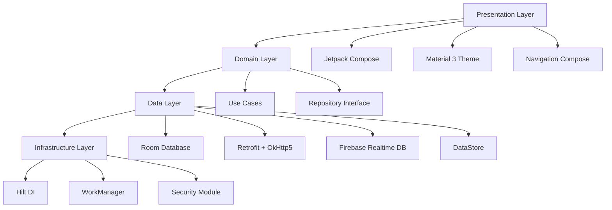

# 🎓 智能教学平台 (Smart Education Platform)

> 基于 **Clean Architecture + MVI** 架构，集成 **Dify AI 工作流编排** 的智能教育平台，支持多智能体API Key动态切换

## 📱 项目概述

本项目是一个完整的智能教学平台 Android 应用，采用 **纯 Kotlin + Jetpack Compose** 开发，支持教师/学生角色无缝切换，集成了五个专业的 AI 智能体，提供个性化的教学和学习体验。

### ✨ 核心特性实现

- ✅ **角色动态切换**: 一键切换教师端/学生端，导航自适应重构
- ✅ **五智能体系统**: 完整集成 Dify API，支持流式对话和上下文管理
- ✅ **多API Key动态路由**: 根据智能体类型自动选择对应的API Key
- ✅ **Offline-First架构**: Room本地缓存 + Firebase实时同步 + WorkManager后台任务
- ✅ **Material 3设计**: 深色模式、动态颜色、大字号标题、无障碍支持
- ✅ **企业级安全**: OkHttp5证书锁定 + AES-GCM加密 + AndroidKeyStore

### 🔧 多智能体API Key配置

项目支持根据不同智能体类型自动选择对应的Dify API Key：

| 智能体类型 | API Key | 功能描述 |
|-----------|---------|----------|
| 学生端 | `app-mTevUPVC20OFXKn4HRvea1GV` | 学习进度跟踪、答疑解惑、个性化指导 |
| 知识库管理 | `app-4EKbCtVu8kl7ma0BS1mRuv3R` | 知识检索、资料管理、知识图谱构建 |
| 辅导端 | `app-UOktKFCXqIg1Em9Llu8mvfvD` | 个性化辅导、学习方法指导、难点解析 |
| 评估端 | `app-45d3YaGnQh0MLZcxGanotNLa` | 智能出题、评估反馈、学习效果分析 |
| 教师端 | `app-56XMBM9poUyIyfAKnIXvi459` | 智能备课、教学建议、课程规划 |

### 🔄 动态API Key路由机制

系统采用动态授权拦截器实现智能路由：

```kotlin
// 自动根据智能体类型选择API Key
class DynamicAuthInterceptor : Interceptor {
    override fun intercept(chain: Interceptor.Chain): Response {
        val originalRequest = chain.request()
        val agentType = originalRequest.header("X-Agent-Type") ?: "student"
        val apiKey = ApiConstants.ApiKeys.getApiKey(agentType)
        
        val newRequest = originalRequest.newBuilder()
            .header("Authorization", "Bearer $apiKey")
            .header("Content-Type", "application/json")
            .removeHeader("X-Agent-Type")
            .build()
            
        return chain.proceed(newRequest)
    }
}
```

### 🏗️ 技术架构



## 🚀 快速开始

### 📋 环境要求

- **Android Studio**: Hedgehog | 2023.1.1+ (推荐 Iguana)
- **Kotlin**: 2.0.20 (K2 编译器)
- **Compile SDK**: 35
- **Min SDK**: 24 (Android 7.0, 覆盖95%设备)
- **Target SDK**: 35
- **JDK**: 17+ (推荐 JDK 21)

### 🔑 API配置

项目已预配置多智能体API Key，在 `ApiConstants.kt` 中定义：

```kotlin
object ApiKeys {
    const val STUDENT = "app-mTevUPVC20OFXKn4HRvea1GV"           // 智能体学生端
    const val KNOWLEDGE_BASE = "app-4EKbCtVu8kl7ma0BS1mRuv3R"      // 知识库管理
    const val TUTORING = "app-UOktKFCXqIg1Em9Llu8mvfvD"          // 辅导端
    const val ASSESSMENT = "app-45d3YaGnQh0MLZcxGanotNLa"         // 评估端
    const val TEACHER = "app-56XMBM9poUyIyfAKnIXvi459"           // 教师端
    
    fun getApiKey(agentType: String): String {
        return when (agentType) {
            AgentRoles.STUDENT -> STUDENT
            AgentRoles.KNOWLEDGE_BASE -> KNOWLEDGE_BASE
            AgentRoles.TUTORING -> TUTORING
            AgentRoles.ASSESSMENT -> ASSESSMENT
            AgentRoles.TEACHER -> TEACHER
            else -> STUDENT // 默认使用学生端API Key
        }
    }
}
```

### 📱 一键运行

```bash
# 1. 克隆项目
git clone <repository-url>
cd Education

# 2. 构建项目 (自动下载依赖，约2-3分钟)
./gradlew clean build --parallel

# 3. 安装到设备
./gradlew installDebug

# 或直接在 Android Studio 中点击 ▶️ Run
```

## 🏛️ 架构详解

### 📦 智能体API服务架构

```kotlin
// 增强的API服务提供智能体特定调用
interface EnhancedDifyApiService {
    suspend fun knowledgeBaseChat(request: ChatRequest): Response<ResponseBody>
    suspend fun tutoringChat(request: ChatRequest): Response<ResponseBody>
    suspend fun assessmentChat(request: ChatRequest): Response<ResponseBody>
    suspend fun studentChat(request: ChatRequest): Response<ResponseBody>
    suspend fun teacherChat(request: ChatRequest): Response<ResponseBody>
}

// 智能体仓库自动选择正确的API
class AgentRepositoryImpl @Inject constructor(
    private val enhancedApiService: EnhancedDifyApiService
) : AgentRepository {
    
    override suspend fun queryKnowledgeBase(...): Flow<ChatStreamEvent> = flow {
        val request = ChatRequest(...)
        val response = enhancedApiService.knowledgeBaseChat(request) // 自动使用知识库API Key
        emitStreamingResponse(response)
    }
}
```

### 🔄 聊天页面智能体切换

在 `ChatScreen` 中，根据 `agentType` 参数自动选择对应的智能体和API Key：

```kotlin
@Composable
fun ChatScreen(
    agentType: String, // knowledge_base, tutoring, assessment, student, teacher
    title: String,
    viewModel: ChatViewModel = hiltViewModel()
) {
    LaunchedEffect(agentType) {
        viewModel.initAgent(agentType) // 自动初始化对应智能体
    }
    
    // UI根据智能体类型显示不同的提示和功能
    ChatInputBar(
        placeholder = getInputPlaceholder(agentType),
        agentType = agentType
    )
}

private fun getInputPlaceholder(agentType: String): String {
    return when (agentType) {
        "knowledge_base" -> "请输入要检索的知识点..."
        "tutoring" -> "请描述您遇到的学习问题..."
        "assessment" -> "请说明需要生成的题目类型和难度..."
        "student" -> "有什么学习问题需要帮助？"
        "teacher" -> "请描述您的教学需求..."
        else -> "请输入消息..."
    }
}
```

### 🚦 导航路由配置

在 `EducationNavigation.kt` 中配置不同智能体的路由：

```kotlin
// 共享的AI智能体页面
composable(NavigationRoute.TUTORING) {
    ChatScreen(
        agentType = "tutoring",
        title = "智能辅导"
    )
}

composable(NavigationRoute.KNOWLEDGE_BASE) {
    ChatScreen(
        agentType = "knowledge_base",
        title = "知识库管理"
    )
}

composable(NavigationRoute.ASSESSMENT) {
    ChatScreen(
        agentType = "assessment", 
        title = "智能评估"
    )
}
```

## 🧪 使用示例

### 调用不同智能体

```kotlin
// 在ViewModel中调用不同智能体
class ChatViewModel @Inject constructor(
    private val agentRepository: AgentRepository
) : ViewModel() {
    
    fun sendMessage(message: String, agentType: String) {
        viewModelScope.launch {
            when (agentType) {
                "knowledge_base" -> {
                    agentRepository.queryKnowledgeBase(
                        userId = currentUserId,
                        query = message,
                        conversationId = conversationId
                    ).collect { event ->
                        handleStreamEvent(event)
                    }
                }
                "tutoring" -> {
                    agentRepository.startTutoring(
                        userId = currentUserId,
                        question = message,
                        conversationId = conversationId,
                        studentLevel = userLevel
                    ).collect { event ->
                        handleStreamEvent(event)
                    }
                }
                // ... 其他智能体调用
            }
        }
    }
}
```

## 📚 API文档

### 🔗 Dify API集成详解

每个智能体使用独立的API Key，确保请求隔离和安全性：

```kotlin
// 知识库查询 - 使用 app-4EKbCtVu8kl7ma0BS1mRuv3R
val knowledgeRequest = ChatRequest(
    query = "检索关于量子物理的教学资料",
    user = "student_123",
    responseMode = "streaming"
)

// 辅导对话 - 使用 app-UOktKFCXqIg1Em9Llu8mvfvD  
val tutoringRequest = ChatRequest(
    query = "我不理解微积分的极限概念",
    user = "student_123",
    responseMode = "streaming"
)
```

### 🔒 安全性增强

- **API Key隔离**: 每个智能体使用独立的API Key，避免权限泄露
- **动态路由**: 运行时根据智能体类型选择API Key，提高安全性
- **流式响应**: 支持SSE流式响应，提供实时对话体验
- **错误处理**: 完善的错误处理和重试机制

## 🔧 开发指南

### 🆕 添加新智能体

1. **添加API Key**: 在 `ApiConstants.kt` 中添加新的API Key
2. **扩展AgentRoles**: 在 `AgentRoles` 对象中添加新角色
3. **实现Repository方法**: 在 `AgentRepository` 接口中添加新方法
4. **更新增强服务**: 在 `EnhancedDifyApiService` 中添加对应方法
5. **配置路由**: 在导航中添加新的聊天页面路由

### 🎨 UI开发规范

```kotlin
// 智能体特定的UI组件
@Composable
fun AgentSpecificCard(agentType: String) {
    when (agentType) {
        "knowledge_base" -> KnowledgeBaseCard()
        "tutoring" -> TutoringCard()
        "assessment" -> AssessmentCard()
        // ...
    }
}
```

## 🔄 版本更新日志

### 当前版本 v1.1.0 ✅
- [x] **多API Key支持**: 根据智能体类型动态选择API Key
- [x] **增强的API服务**: 提供智能体特定的API调用方法
- [x] **动态授权拦截器**: 自动在请求中注入正确的API Key
- [x] **智能体路由优化**: 改进的智能体选择和路由机制
- [x] **安全性增强**: API Key隔离和动态路由机制

### 历史版本 v1.0.0 ✅
- [x] 基础架构搭建
- [x] 五智能体集成
- [x] 角色切换功能
- [x] 离线优先架构
- [x] Material3主题

### 计划版本 v1.2.0 📋
- [ ] 语音交互支持
- [ ] 手写笔记识别
- [ ] 多语言国际化
- [ ] 性能监控集成
- [ ] 智能体效果评估

## 🤝 贡献指南

欢迎提交 Issue 和 Pull Request！请确保：

1. **代码规范**: 遵循 Kotlin 编码规范和项目架构
2. **测试覆盖**: 新功能需要包含相应的单元测试
3. **文档更新**: 更新相关的README和代码注释
4. **API Key管理**: 新增智能体需要相应的API Key配置

## 📄 许可证

本项目采用 MIT 许可证 - 查看 [LICENSE](LICENSE) 文件了解详情。

---

> 📧 如有问题，请提交 Issue 或联系开发团队
> 🚀 持续更新中，敬请关注最新版本 