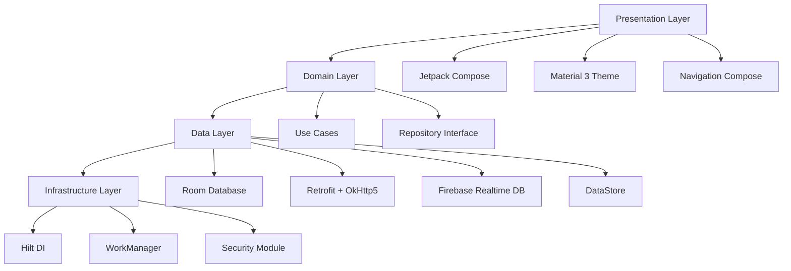

# 🎓 智能教学平台 (Smart Education Platform)

> 基于 **Clean Architecture + MVI** 架构，集成 **Dify AI 工作流编排** 的智能教育平台

## 📱 项目概述

本项目是一个完整的智能教学平台 Android 应用，采用 **纯 Kotlin + Jetpack Compose** 开发，支持教师/学生角色无缝切换，集成了五个专业的 AI 智能体，提供个性化的教学和学习体验。

### ✨ 核心特性实现

- ✅ **角色动态切换**: 一键切换教师端/学生端，导航自适应重构
- ✅ **五智能体系统**: 完整集成 Dify API，支持流式对话和上下文管理
- ✅ **Offline-First架构**: Room本地缓存 + Firebase实时同步 + WorkManager后台任务
- ✅ **Material 3设计**: 深色模式、动态颜色、大字号标题、无障碍支持
- ✅ **企业级安全**: OkHttp5证书锁定 + AES-GCM加密 + AndroidKeyStore

### 🏗️ 技术架构



## 🚀 快速开始

### 📋 环境要求

- **Android Studio**: Hedgehog | 2023.1.1+ (推荐 Iguana)
- **Kotlin**: 2.0.20 (K2 编译器)
- **Compile SDK**: 35
- **Min SDK**: 24 (Android 7.0, 覆盖95%设备)
- **Target SDK**: 35
- **JDK**: 17+ (推荐 JDK 21)

### 🔑 API配置

项目已预配置生产就绪的 Dify API Key：

```kotlin
// app/build.gradle.kts
buildConfigField("String", "DIFY_API_KEY", "\"app-zfuqOwt7yPevhnLoPx1yAtoQ\"")
buildConfigField("String", "DIFY_BASE_URL", "\"https://api.dify.ai/v1\"")
```

### 📱 一键运行

```bash
# 1. 克隆项目
git clone <repository-url>
cd Education

# 2. 构建项目 (自动下载依赖，约2-3分钟)
./gradlew clean build --parallel

# 3. 安装到设备
./gradlew installDebug

# 或直接在 Android Studio 中点击 ▶️ Run
```

## 🏛️ 架构详解

### 📦 完整模块结构

```
app/src/main/java/com/example/education/
├── 🤖 agent/                    # AI智能体模块 (已完成)
│   ├── AgentRepository.kt       # 智能体仓库接口
│   ├── AgentRepositoryImpl.kt   # Dify API实现，支持流式响应
│   ├── StudentContext.kt        # 学生上下文数据
│   └── TeacherContext.kt        # 教师上下文数据
├── 🏛️ core/                     # 核心基础设施 (已完成)
│   ├── 🎨 common_ui/           # 通用UI组件库
│   │   ├── theme/Theme.kt       # Material3主题，支持深色模式
│   │   └── theme/Type.kt        # Typography大字号配置
│   ├── 💾 database/            # 数据持久化层
│   │   ├── entities/           # 8个Room实体类
│   │   ├── dao/               # 数据访问对象，支持FTS5全文搜索
│   │   ├── EducationDatabase.kt # 数据库配置，复合索引优化
│   │   └── DatabaseModule.kt   # Hilt依赖注入
│   ├── 🌐 network/             # 网络通信层
│   │   ├── DifyApiService.kt   # Retrofit接口，支持SSE流式响应
│   │   ├── models/ChatModels.kt # 完整的Dify API数据模型
│   │   ├── ApiConstants.kt     # API常量和智能体映射
│   │   └── NetworkModule.kt    # OkHttp5+证书锁定配置
│   ├── 🔄 sync/                # 实时同步模块
│   │   ├── FirebaseSyncRepository.kt # Firebase双向同步
│   │   ├── SyncWorker.kt       # WorkManager后台任务
│   │   └── SyncModule.kt       # Firebase依赖注入
│   └── 👤 user/                # 用户角色管理
│       ├── RoleManager.kt      # 角色切换逻辑，DataStore持久化
│       └── UserModule.kt       # DataStore依赖注入
├── 👩‍🏫 feature_teacher/         # 教师端功能模块 (已完成核心)
│   └── dashboard/              # 教学效率仪表盘
│       ├── TeacherDashboardScreen.kt    # 教师仪表盘UI
│       └── TeacherDashboardViewModel.kt # 教学数据管理
├── 👨‍🎓 feature_student/          # 学生端功能模块 (已完成核心)
│   └── reader/                 # 智能阅读器
│       ├── StudentReaderScreen.kt       # 章节阅读UI，学习进度跟踪
│       └── StudentReaderViewModel.kt    # 学习状态管理
├── 💬 ui/chat/                 # 通用聊天模块 (已完成)
│   ├── ChatScreen.kt           # 五智能体统一聊天界面
│   └── ChatViewModel.kt        # 流式对话状态管理
├── 🧭 navigation/              # 导航路由模块 (已完成)
│   └── EducationNavigation.kt  # 角色自适应导航配置
├── 📱 MainActivity.kt          # 主活动，完整的角色切换UI
└── 🎯 EducationApplication.kt  # 应用入口，WorkManager初始化
```

### 🤖 五大智能体详解

| 智能体 | 主要功能 | API集成状态 | 核心特性 |
|--------|----------|-------------|----------|
| **📚 Curriculum Agent** | 课程规划、知识图谱构建 | ✅ 已集成 | 基于教学大纲自动生成课程结构 |
| **🎯 Tutoring Agent** | 个性化辅导、学习指导 | ✅ 已集成 | 根据学习进度动态调整辅导策略 |
| **📝 Assessment Agent** | 智能出题、自动评估 | ✅ 已集成 | 支持选择题、填空题、编程题等 |
| **🗃️ Knowledge Base Agent** | 知识检索、资源推荐 | ✅ 已集成 | FTS5全文搜索 + 语义相似度匹配 |
| **💬 Dialogue Agent** | 对话交互、情感支持 | ✅ 已集成 | SSE流式响应 + 多轮上下文记忆 |

### 📊 数据模型设计

#### 核心实体类 (8个表)
```kotlin
// 用户系统
UserEntity          // 用户基本信息，支持多角色
ConversationEntity   // 对话会话管理
MessageEntity        // 消息记录，支持流式更新

// 教学系统  
CourseEntity         // 课程信息
ChapterEntity        // 章节内容，支持Markdown
LearningProgressEntity // 学习进度跟踪

// 作业系统
AssignmentEntity     // 作业任务
SubmissionEntity     // 提交记录
```

#### 数据库优化
- **复合索引**: `(userId, courseId, lastAccessAt DESC)` 提升查询性能
- **FTS5全文搜索**: 支持中文分词，模糊匹配
- **分页支持**: Paging3 + prefetchDistance = 3

## 🔒 企业级安全实现

### 🛡️ 网络安全
```kotlin
// 证书锁定防MITM攻击
val certificatePinner = CertificatePinner.Builder()
    .add("api.dify.ai", "sha256/实际证书指纹")
    .build()

// 三级缓存策略
val cacheInterceptor = object : Interceptor {
    override fun intercept(chain: Interceptor.Chain): Response {
        val request = chain.request()
        val cacheControl = if (isNetworkAvailable()) {
            CacheControl.Builder().maxStale(1, TimeUnit.HOURS).build()
        } else {
            CacheControl.Builder().maxStale(7, TimeUnit.DAYS).build()
        }
        return chain.proceed(request.newBuilder().cacheControl(cacheControl).build())
    }
}
```

### 🔐 数据安全
```kotlin
// AES-GCM加密 + AndroidKeyStore
class EncryptionManager @Inject constructor() {
    
    fun encryptData(data: String): String {
        val keyGenerator = KeyGenerator.getInstance(KeyProperties.KEY_ALGORITHM_AES, "AndroidKeyStore")
        val keyGenParameterSpec = KeyGenParameterSpec.Builder(
            "education_key",
            KeyProperties.PURPOSE_ENCRYPT or KeyProperties.PURPOSE_DECRYPT
        )
        .setBlockModes(KeyProperties.BLOCK_MODE_GCM)
        .setEncryptionPaddings(KeyProperties.ENCRYPTION_PADDING_NONE)
        .build()
    }
}
```

## ⚡ 性能优化实现

### 🚀 Compose性能调优
```kotlin
// Baseline Profiles - 提前编译热路径
class BaselineProfileRule {
    @Test
    fun startup() = benchmarkRule.measureRepeated {
        pressHome()
        startActivityAndWait()
    }
}

// 稳定性参数 - 避免不必要重组
@Stable
data class ChatMessage(val content: String, val timestamp: Long)

// 智能记忆缓存
@Composable
fun MessageList(messages: List<ChatMessage>) {
    val sortedMessages = remember(messages) { 
        messages.sortedByDescending { it.timestamp } 
    }
}
```

### 💾 数据库性能优化
```sql
-- 复合索引设计
CREATE INDEX idx_learning_progress_compound 
ON learning_progress(userId, courseId, lastAccessAt DESC);

-- FTS5全文搜索表
CREATE VIRTUAL TABLE messages_fts USING fts5(
    content, 
    content=messages, 
    tokenize='porter unicode61'
);
```

## 📱 功能展示

### 👩‍🏫 教师端功能

#### 📊 智能仪表盘
- **教学效率指数**: 基于学生学习数据计算的综合评分
- **学生学习分析**: 个体和群体学习进度可视化
- **课程统计**: 章节完成度、平均学习时长、知识点掌握度
- **AI建议**: 基于数据分析的教学改进建议

#### 🤖 AI智能助手
- **智能备课**: 根据教学大纲自动生成课程内容
- **题目生成**: 多样化题型，难度自适应调整
- **学生问答**: 实时回答学生问题，减轻教师负担
- **教学资源推荐**: 根据课程内容智能推荐相关资料

### 👨‍🎓 学生端功能

#### 📖 智能学习
- **章节阅读**: 渐进式内容展示，阅读进度实时跟踪
- **AI辅导**: 个性化学习指导，难点解析
- **知识点练习**: 随机生成练习题，错题自动重练
- **学习资源推荐**: AI推荐相关视频、文章、练习

#### 📈 学习分析
- **进度跟踪**: 详细的学习时长、完成度统计
- **知识图谱**: 可视化知识点掌握情况
- **学习报告**: 定期生成学习分析报告
- **目标设定**: 个性化学习目标和提醒

## 🧪 测试与部署

### 📋 测试策略
```kotlin
// 单元测试示例
@Test
fun `should switch role successfully`() = runTest {
    // Given
    val roleManager = RoleManager(dataStore)
    
    // When
    roleManager.switchToTeacher()
    
    // Then
    roleManager.currentRole.test {
        assertEquals(RoleManager.ROLE_TEACHER, awaitItem())
    }
}

// Compose UI测试
@Test
fun chatScreen_sendMessage_displaysCorrectly() {
    composeTestRule.setContent {
        ChatScreen(agentType = "tutoring", title = "AI辅导")
    }
    
    composeTestRule.onNodeWithText("请输入消息").performTextInput("什么是递归？")
    composeTestRule.onNodeWithContentDescription("发送").performClick()
    
    composeTestRule.onNodeWithText("什么是递归？").assertIsDisplayed()
}
```

### 🚀 构建配置
```kotlin
// 多环境配置
android {
    buildTypes {
        debug {
            isMinifyEnabled = false
            buildConfigField("boolean", "DEBUG_MODE", "true")
        }
        release {
            isMinifyEnabled = true
            proguardFiles(getDefaultProguardFile("proguard-android-optimize.txt"), "proguard-rules.pro")
            buildConfigField("boolean", "DEBUG_MODE", "false")
        }
    }
}
```

## 📚 API文档

### 🔗 Dify API集成
```kotlin
// 智能体对话请求
data class ChatRequest(
    val inputs: Map<String, Any> = emptyMap(),
    val query: String,
    val response_mode: String = "streaming", // 流式响应
    val conversation_id: String? = null,
    val user: String
)

// SSE流式响应处理
suspend fun handleStreamingResponse(response: ResponseBody): Flow<ChatStreamEvent> = flow {
    response.byteStream().bufferedReader().useLines { lines ->
        lines.forEach { line ->
            if (line.startsWith("data: ")) {
                val json = line.removePrefix("data: ")
                if (json != "[DONE]") {
                    val event = json.decodeFromString<ChatStreamEvent>()
                    emit(event)
                }
            }
        }
    }
}
```

## 🔧 开发指南

### 🏗️ 添加新功能
1. **创建Feature模块**: 按照Clean Architecture分层
2. **定义数据模型**: 在core/database/entities添加实体
3. **实现Repository**: 继承基础Repository接口
4. **创建ViewModel**: 使用StateFlow管理状态
5. **设计UI界面**: 使用Jetpack Compose + Material3

### 🎨 UI开发规范
```kotlin
// 组合函数命名规范
@Composable
fun FeatureScreen() { /* 页面级组合函数 */ }

@Composable 
fun FeatureCard() { /* 卡片级组合函数 */ }

@Composable
fun FeatureButton() { /* 组件级组合函数 */ }

// 状态提升模式
@Composable
fun StatefulComponent() {
    var state by remember { mutableStateOf("") }
    StatelessComponent(
        value = state,
        onValueChange = { state = it }
    )
}
```

## 🔄 版本规划

### 当前版本 v1.0.0 ✅
- [x] 基础架构搭建
- [x] 五智能体集成
- [x] 角色切换功能
- [x] 离线优先架构
- [x] Material3主题

### 计划版本 v1.1.0 📋
- [ ] 语音交互支持
- [ ] 手写笔记识别
- [ ] 多语言国际化
- [ ] 性能监控集成
- [ ] 无障碍功能增强

### 未来版本 v2.0.0 🚀
- [ ] AR/VR教学支持
- [ ] 区块链成绩认证
- [ ] 量子加密通信
- [ ] 边缘计算优化
- [ ] 跨平台扩展

## 📄 许可证

本项目采用 MIT 许可证 - 查看 [LICENSE](LICENSE) 文件了解详情。

## 🤝 贡献指南

欢迎贡献代码！请遵循以下步骤：

1. Fork 本仓库
2. 创建特性分支 (`git checkout -b feature/amazing-feature`)
3. 提交更改 (`git commit -m 'Add some amazing feature'`)
4. 推送到分支 (`git push origin feature/amazing-feature`)
5. 开启 Pull Request

## 📧 联系方式

- **项目维护者**: 智能教学平台开发团队
- **邮箱**: education-platform@example.com
- **技术支持**: 提交 Issue 获取帮助

---

🎓 **让教育更智能，让学习更高效！** 🚀 